# WeatherFlow: Interactive Weather AI Platform

<div align="center">


**🌍 Train AI weather models • 🔬 Real scientific data • 📊 No code required**

[**🚀 Launch App**](#-quick-start-10-seconds) • [**📖 Documentation**](#-complete-streamlit-app-guide) • [**🤝 Contribute**](#-contributing-to-weatherflow)

</div>

---

## 🎯 What is WeatherFlow?

WeatherFlow is an **interactive platform for training and experimenting with AI weather prediction models**. Through our Streamlit app, you can:

- **Train real neural networks** on actual NCEP/NCAR reanalysis data
- **Visualize weather predictions** with publication-quality graphics
- **Benchmark models** against GraphCast, Pangu-Weather, and FourCastNet
- **Learn atmospheric dynamics** through interactive educational tools
- **No coding required** – every Python module in this repository is accessible through the web interface

> **The Magic:** The Streamlit app isn't a demo with fake data – it executes the actual Python code from the `weatherflow/`, `applications/`, and `gcm/` modules. Every calculation, every model, every visualization runs real code.

---

## 🚀 Quick Start (10 Seconds)

### Option 1: Run Locally (Recommended)

```bash
# Clone and install
git clone https://github.com/monksealseal/weatherflow.git
cd weatherflow
pip install -r streamlit_app/requirements.txt

# Launch the app
streamlit run streamlit_app/Home.py
```

Open http://localhost:8501 – you'll see real weather data within 10 seconds!

### Option 2: Streamlit Cloud

Deploy your own instance:
1. Fork this repository
2. Go to [share.streamlit.io](https://share.streamlit.io/)
3. Connect your fork
4. Set main file: `streamlit_app/Home.py`
5. Deploy!

---

## 🧠 How the Streamlit App Works

The Streamlit app is a **live interface to all Python code** in this repository. Here's how it works:

```mermaid
graph TB
    subgraph "Streamlit App (streamlit_app/)"
        HOME[🏠 Home.py<br/>Dashboard & Status]
        
        subgraph "Data Layer"
            DM[📊 Data Manager<br/>Load NCEP/ERA5 data]
        end
        
        subgraph "Training Layer"
            TW[🧠 Training Workflow<br/>Real PyTorch training]
            FM[🌊 Flow Matching<br/>Flow model demos]
            PL[⚡ Physics Losses<br/>Conservation laws]
        end
        
        subgraph "Prediction Layer"
            WP[🔮 Weather Prediction<br/>Generate forecasts]
            MC[📈 Model Comparison<br/>WeatherBench2 benchmarks]
        end
        
        subgraph "Applications Layer"
            WIND[🌬️ Wind Power<br/>WindPowerConverter]
            SOLAR[☀️ Solar Power<br/>SolarPowerConverter]
            EXTREME[🌡️ Extreme Events<br/>Heatwave/AR detection]
        end
        
        subgraph "Science Layer"
            GCM[🌍 GCM Simulation<br/>Climate modeling]
            EDU[📚 Education<br/>Atmospheric dynamics]
            VIZ[🎨 Visualization<br/>Weather maps]
        end
        
        subgraph "Advanced Layer"
            HUR[🌀 Hurricane Tracking<br/>IBTrACS/HURDAT2]
            WB2[📊 WeatherBench2<br/>Standard metrics]
            WS[🌐 Worldsphere<br/>AI command center]
        end
    end
    
    subgraph "Python Backend"
        WF[weatherflow/<br/>Core ML models]
        APP[applications/<br/>Domain apps]
        GCMLIB[gcm/<br/>Climate model]
    end
    
    HOME --> DM
    DM --> TW
    TW --> WP
    WP --> MC
    
    WIND --> APP
    SOLAR --> APP
    EXTREME --> APP
    
    TW --> WF
    FM --> WF
    PL --> WF
    
    GCM --> GCMLIB
    
    style HOME fill:#e0f2fe
    style TW fill:#dcfce7
    style WP fill:#fef3c7
```



### The Key Insight

When you click buttons in the Streamlit app, you're running **real Python code**:

| Streamlit Page | Python Module Being Executed | What It Does |
|---------------|------------------------------|--------------|
| Training Workflow | `weatherflow.models.flow_matching.WeatherFlowMatch` | Real PyTorch neural network training |
| Wind Power | `applications.renewable_energy.wind_power.WindPowerConverter` | Actual turbine power curve calculations |
| Solar Power | `applications.renewable_energy.solar_power.SolarPowerConverter` | Real PVlib solar calculations |
| Extreme Events | `applications.extreme_event_analysis.detectors` | Scientific event detection algorithms |
| GCM Simulation | `gcm.core.model.GCM` | Full atmospheric physics simulation |
| Education | `weatherflow.education.graduate_tool` | Atmospheric dynamics calculations |

---

## 📖 Complete Streamlit App Guide

### 🏠 Home Dashboard

The central hub showing your operational status:
- **Data Status**: Whether NCEP/ERA5 data is loaded
- **Model Status**: If you have trained checkpoints
- **Quick Actions**: One-click access to core workflows
- **Benchmarks**: WeatherBench2 leaderboard comparison

### Core Workflow Pages

#### 📊 Data Manager (`pages/0_Data_Manager.py`)
**Purpose**: Load and manage weather datasets

- Download 7 MB NCEP/NCAR reanalysis sample (one click!)
- Load ERA-Interim or WeatherBench2 data
- Upload custom weather data
- Visualize loaded data in real-time

**Use when**: Starting a new project or switching datasets

---

#### 🧠 Training Workflow (`pages/03_Training_Workflow.py`)
**Purpose**: Train real neural network weather models

- Configure model architecture (layers, attention, physics)
- Set training parameters (epochs, batch size, learning rate)
- Watch real-time loss curves during training
- Save checkpoints for later use

**Use when**: You want to train your own weather prediction model

---

#### 🔮 Weather Prediction (`pages/17_Weather_Prediction.py`)
**Purpose**: Generate forecasts with trained models

- Load saved model checkpoints
- Initialize from current weather conditions
- Generate multi-day forecasts
- Professional weather-style visualizations

**Use when**: Making actual weather predictions

---

#### 📈 Model Comparison (`pages/12_Model_Comparison.py`)
**Purpose**: Benchmark against state-of-the-art models

- Compare your model to GraphCast, Pangu-Weather, FourCastNet
- WeatherBench2 standard metrics (Z500 RMSE, T850, etc.)
- Efficiency analysis
- Export comparison charts

**Use when**: Evaluating model performance scientifically

---

### Application Pages

#### 🌬️ Wind Power (`pages/1_Wind_Power.py`)
**Purpose**: Convert weather forecasts to wind farm power output

- Select from real turbine models (Vestas V90, Siemens SG 14, etc.)
- Configure wind farm parameters
- Calculate power production from wind data
- Capacity factor and annual energy estimates

**Runs**: `applications/renewable_energy/wind_power.py`

---

#### ☀️ Solar Power (`pages/2_Solar_Power.py`)
**Purpose**: Solar energy forecasting

- Configure PV system specifications
- Calculate solar irradiance and power
- Account for temperature effects
- Grid integration tools

**Runs**: `applications/renewable_energy/solar_power.py`

---

#### 🌡️ Extreme Events (`pages/3_Extreme_Events.py`)
**Purpose**: Detect and analyze extreme weather

- Heatwave detection with configurable thresholds
- Atmospheric river identification
- Extreme precipitation analysis
- Event statistics and visualization

**Runs**: `applications/extreme_event_analysis/detectors.py`

---

### Science & Research Pages

#### 🌊 Flow Matching (`pages/4_Flow_Matching.py`)
**Purpose**: Interactive flow matching model exploration

- Build and configure WeatherFlowMatch models
- Visualize flow fields and ODE integration
- Run training demonstrations
- Understand how flow matching works

**Runs**: `weatherflow/models/flow_matching.py`

---

#### ⚡ Physics Losses (`pages/8_Physics_Losses.py`)
**Purpose**: Explore physics-informed machine learning

- Mass conservation constraints
- Energy conservation losses
- Potential vorticity preservation
- Geostrophic balance enforcement

**Runs**: `weatherflow/physics/losses.py`

---

#### 🌍 GCM Simulation (`pages/5_GCM_Simulation.py`)
**Purpose**: Run climate model simulations

- Configure grid resolution
- Set CO₂ concentrations
- Run multi-day simulations
- Analyze climate diagnostics

**Runs**: `gcm/core/model.py`

---

#### 📚 Education (`pages/6_Education.py`)
**Purpose**: Learn atmospheric dynamics

- Geostrophic wind calculator
- Rossby wave laboratory
- Potential vorticity visualization
- Practice problems with solutions

**Runs**: `weatherflow/education/graduate_tool.py`

---

### Advanced Pages

#### 📊 WeatherBench2 Metrics (`pages/16_WeatherBench2_Metrics.py`)
**Purpose**: Standard evaluation metrics

- Headline metrics (Z500, T850, T2M, WS10, etc.)
- RMSE, MAE, ACC, SEEPS calculations
- Regional analysis (Global, Tropics, Extra-tropics)
- Lead time degradation curves

---

#### 🌀 Hurricane Tracking (`pages/22_Hurricane_Tracking.py`)
**Purpose**: Tropical cyclone analysis

- IBTrACS historical data
- HURDAT2 Atlantic database
- Storm track visualization
- Intensity analysis

---

#### 🌐 Worldsphere Command Center (`pages/20_Worldsphere_Command_Center.py`)
**Purpose**: Advanced AI model management

- CycleGAN models for satellite translation
- Video diffusion for atmospheric sequences
- Model registry and experiment tracking

---

## 🔧 Installation for Development

### Full Development Setup

```bash
# Clone the repository
git clone https://github.com/monksealseal/weatherflow.git
cd weatherflow

# Create virtual environment
python -m venv venv
source venv/bin/activate  # On Windows: venv\Scripts\activate

# Install core package
pip install -e .

# Install Streamlit app dependencies
pip install -r streamlit_app/requirements.txt

# Install development tools
pip install -r requirements-dev.txt
```

### Run the App

```bash
# From repository root
streamlit run streamlit_app/Home.py

# Or from streamlit_app directory
cd streamlit_app
streamlit run Home.py
```

### Run Tests

```bash
pytest tests/
```

---

## 🤝 Contributing to WeatherFlow

We welcome contributions from the weather AI community! Here's how to get involved:

### Ways to Contribute

1. **🐛 Report Bugs**: Open an issue describing the problem
2. **💡 Suggest Features**: Propose new pages or functionality
3. **📝 Improve Documentation**: Help make things clearer
4. **🔬 Add Science**: Contribute new physics constraints or metrics
5. **🎨 Enhance Visualizations**: Create better weather displays
6. **🧠 Build Models**: Add new model architectures

### Contribution Workflow

```bash
# 1. Fork the repository on GitHub

# 2. Clone your fork
git clone https://github.com/YOUR-USERNAME/weatherflow.git
cd weatherflow

# 3. Create a feature branch
git checkout -b feature/your-feature-name

# 4. Make your changes
# - Add code in appropriate directories
# - Add tests in tests/
# - Update documentation

# 5. Run tests
pytest tests/

# 6. Format code
black .
isort --profile black .

# 7. Commit and push
git add .
git commit -m "Add: your feature description"
git push origin feature/your-feature-name

# 8. Open a Pull Request on GitHub
```

### Adding a New Streamlit Page

1. Create your page in `streamlit_app/pages/XX_YourPage.py`
2. Import real Python modules (not mock data!)
3. Add proper docstring explaining which code it runs
4. Include user-friendly UI with Streamlit widgets
5. Test locally before submitting PR

### Code Style

- Follow PEP 8
- Use type hints
- Write Google-style docstrings
- Add tests for new features
- Keep functions focused and small

---

## 🌍 Vision: Democratizing Weather AI

### Our Mission

WeatherFlow exists to **make weather AI accessible to everyone**:

- **Researchers**: Rapidly prototype and benchmark new ideas
- **Students**: Learn atmospheric dynamics interactively
- **Developers**: Build weather applications without PhD-level expertise
- **Community**: Collaborate on open-source weather intelligence

### Roadmap

- [ ] **Real-time data**: Live NOAA/ECMWF data feeds
- [ ] **Pre-trained models**: Download and use immediately
- [ ] **Multi-GPU training**: Scale to larger models
- [ ] **Ensemble forecasting**: Probabilistic predictions
- [ ] **Regional models**: High-resolution limited area models
- [ ] **Mobile app**: Weather predictions on your phone

### Join the Community

- ⭐ Star this repo to show support
- 🔔 Watch for updates
- 💬 Join discussions in Issues
- 🐦 Share your work on social media with #WeatherFlow

---

## 📚 Additional Resources

### Documentation

| Resource | Description |
|----------|-------------|
| [Training Instructions](TRAINING_INSTRUCTIONS.txt) | Step-by-step model training guide |
| [Backend Quickstart](BACKEND_QUICKSTART.md) | Deploy the API server |
| [Model Zoo](model_zoo/README.md) | Pre-trained model infrastructure |
| [Applications](applications/README.md) | Domain-specific examples |
| [API Reference](docs/api_reference.md) | Python API documentation |

### Related Projects

- [WeatherBench2](https://sites.research.google/weatherbench) - Standardized evaluation
- [GraphCast](https://arxiv.org/abs/2212.12794) - Google DeepMind's weather model
- [Pangu-Weather](https://arxiv.org/abs/2211.02556) - Huawei's foundation model
- [ERA5](https://cds.climate.copernicus.eu/) - ECMWF reanalysis data

---

## 📜 License & Citation

WeatherFlow is released under the **MIT License**. See [LICENSE](LICENSE) for details.

If you use WeatherFlow in your research, please cite:

```bibtex
@software{weatherflow2023,
  author = {Siman, Eduardo},
  title = {WeatherFlow: Interactive Weather AI Platform},
  url = {https://github.com/monksealseal/weatherflow},
  year = {2023}
}
```

---

<div align="center">

**Built with ❤️ for the Weather AI Community**

[🚀 Get Started](#-quick-start-10-seconds) • [📖 Full Guide](#-complete-streamlit-app-guide) • [🤝 Contribute](#-contributing-to-weatherflow)

</div>

